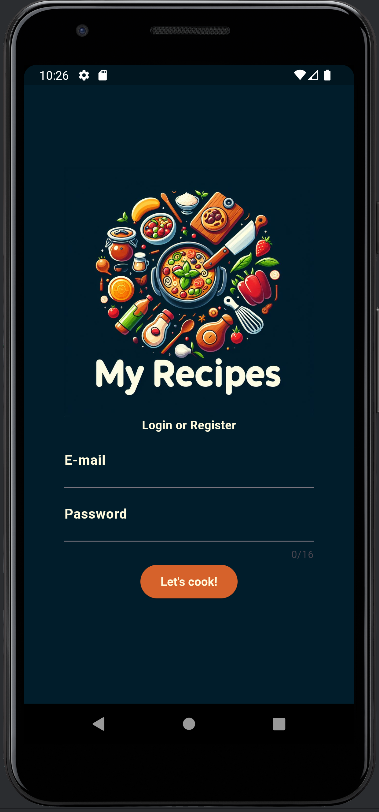
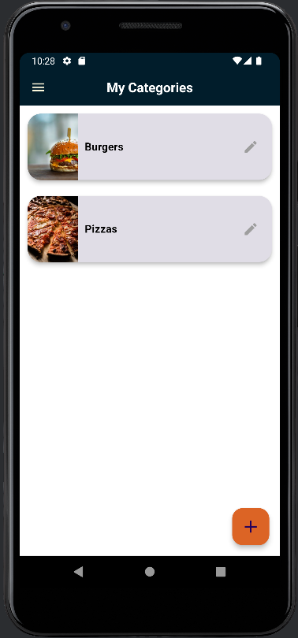
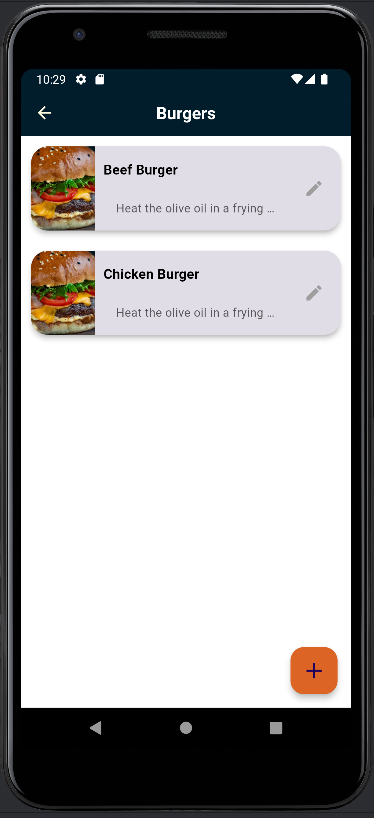
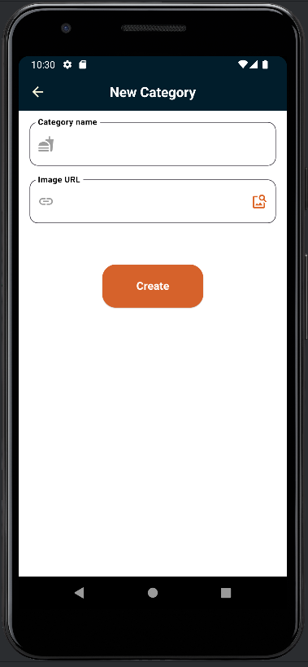
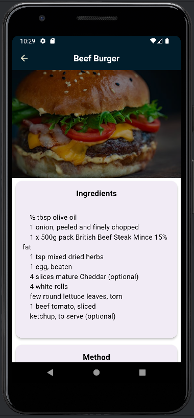
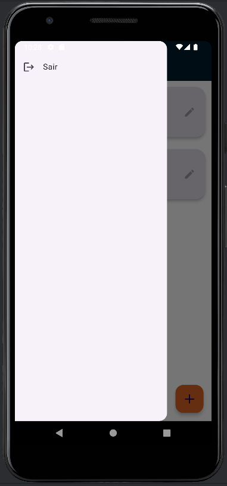

# 🍳 My Recipes App

Uma aplicação Flutter para gerenciar suas receitas pessoais, organizadas por categorias. Crie, edite e organize suas receitas favoritas de forma intuitiva e prática.

## 📱 Funcionalidades

- **Autenticação de Usuário**: Login e registro com sistema de tokens JWT
- **Gerenciamento de Categorias**: Crie e organize suas receitas por categorias personalizadas
- **CRUD de Receitas**: Crie, visualize, edite e exclua suas receitas
- **Upload de Imagens**: Adicione fotos às suas receitas e categorias
- **Interface Intuitiva**: Design moderno e responsivo
- **Armazenamento Local**: Dados salvos localmente para acesso offline

## 🛠️ Tecnologias Utilizadas

- **Flutter** - Framework de desenvolvimento mobile
- **Dart** - Linguagem de programação
- **HTTP** - Comunicação com API REST
- **SharedPreferences** - Armazenamento local
- **Google Fonts** - Tipografia personalizada
- **UUID** - Geração de identificadores únicos
- **HTTP Interceptor** - Interceptação de requisições HTTP

## 📋 Pré-requisitos

- Flutter SDK (>=3.2.6)
- Dart SDK
- Android Studio / VS Code
- Git

## 🚀 Instalação

1. **Clone o repositório**
   ```bash
   git clone https://github.com/seu-usuario/My-Recipes.git
   cd My-Recipes
   ```

2. **Instale as dependências**
   ```bash
   flutter pub get
   ```

3. **Configure as variáveis de ambiente**
   - Crie um arquivo `.env` na raiz do projeto
   - Adicione a URL da sua API:
     ```
     API_URL=https://sua-api-url.com
     ```

4. **Execute a aplicação**
   ```bash
   flutter run
   ```

## 📱 Plataformas Suportadas

- ✅ Android
- ✅ iOS
- ✅ Web
- ✅ macOS
- ✅ Windows
- ✅ Linux

## 🏗️ Estrutura do Projeto

```
lib/
├── common/                 # Componentes comuns
│   ├── confirmation_dialog.dart
│   ├── exception_dialog.dart
│   ├── logout.dart
│   └── remove_confirmation_dialog.dart
├── models/                 # Modelos de dados
│   ├── category.dart
│   ├── ingredient.dart
│   └── recipe.dart
├── routes/                 # Gerenciamento de rotas
│   └── route_generator.dart
├── screens/               # Telas da aplicação
│   ├── Add-Category-Screen/
│   ├── Add-Recipe-Screen/
│   ├── Category-Screen/
│   ├── Home-Screen/
│   ├── Login-Screen/
│   └── Recipe-Screen/
├── services/              # Serviços de API
│   ├── auth_service.dart
│   ├── category_service.dart
│   ├── http_interceptors.dart
│   ├── image_service.dart
│   ├── recipe_service.dart
│   └── web_client.dart
├── theme/                 # Tema da aplicação
│   └── theme.dart
└── main.dart              # Ponto de entrada
```

## 🔧 Configuração da API

A aplicação se conecta a uma API REST. Certifique-se de que sua API tenha os seguintes endpoints:

### Autenticação
- `POST /login` - Login do usuário
- `POST /register` - Registro de usuário

### Categorias
- `GET /users/{userId}/categories` - Listar categorias
- `POST /categories` - Criar categoria
- `PUT /categories/{id}` - Atualizar categoria
- `DELETE /categories/{id}` - Excluir categoria

### Receitas
- `GET /users/{userId}/recipes?catId={catId}` - Listar receitas por categoria
- `POST /recipes` - Criar receita
- `PUT /recipes/{id}` - Atualizar receita
- `DELETE /recipes/{id}` - Excluir receita

## 📸 Screenshots

| Login | Home | Categorias |
|-------|------|------------|
|  |  |  |

| Nova Categoria | Nova Receita | Menu |
|----------------|--------------|------|
|  |  |  |

## 🎨 Tema e Design

A aplicação utiliza um tema personalizado com:
- **Cores**: Paleta de cores moderna e agradável
- **Tipografia**: Google Fonts para melhor legibilidade
- **Componentes**: Material Design com customizações
- **Responsividade**: Adaptável a diferentes tamanhos de tela

## 🔐 Segurança

- **Autenticação JWT**: Tokens seguros para autenticação
- **Interceptadores HTTP**: Gerenciamento automático de tokens
- **Validação de Dados**: Validação tanto no cliente quanto no servidor
- **Armazenamento Seguro**: Dados sensíveis armazenados com SharedPreferences

## 🚀 Deploy

### Android
```bash
flutter build apk --release
```

### iOS
```bash
flutter build ios --release
```

## 📝 Licença

Este projeto está sob a licença MIT. Veja o arquivo [LICENSE](LICENSE) para mais detalhes.

## 👨‍💻 Autor

**Bruno Pires**
- GitHub: [@seu-usuario](https://github.com/seu-usuario)
- LinkedIn: [Bruno Pires](https://linkedin.com/in/bruno-pires)


## 🔄 Changelog

### v1.0.0
- ✅ Sistema de autenticação completo
- ✅ CRUD de categorias
- ✅ CRUD de receitas
- ✅ Upload de imagens
- ✅ Interface responsiva
- ✅ Suporte multiplataforma

---

⭐ **Se este projeto foi útil para você, considere dar uma estrela!**